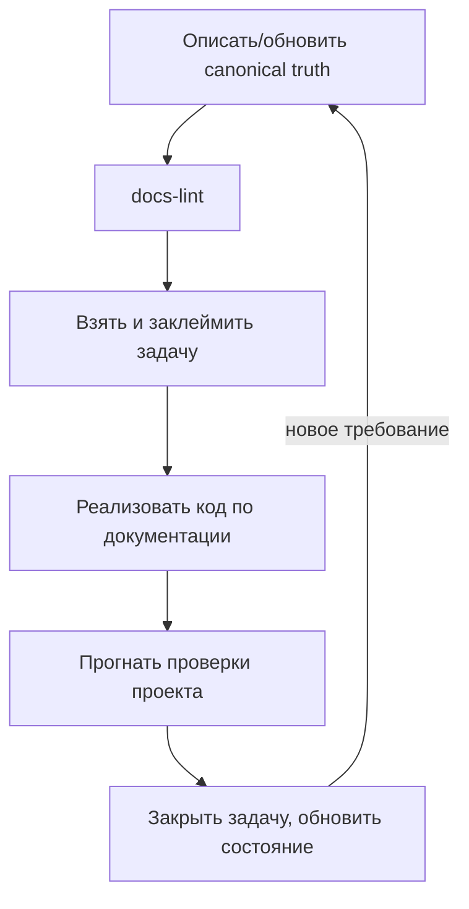

# Rocket

Лёгкий фреймворк для агентной разработки, ориентированный на **одного оператора**.

Текущая версия: `v0.1.0`.

## Идея в одном абзаце

Код подчиняется канонической документации. Сначала фиксируется правда о продукте (что он
должен делать), затем пишется код. Если код расходится с правдой — прав документ, код
догоняет. По документам всегда можно восстановить и запустить рабочий проект. Агент работает
автономно, но останавливается и спрашивает человека в опасных или неоднозначных ситуациях.

## Чем Rocket отличается

Это упрощённый потомок более тяжёлого фреймворка. Сознательно убраны: распределённая
координация, релизные ветки и freeze, обязательная многошаговая церемония claim/admit,
companion-shell и swarm-режимы. Осталось только то, что даёт ценность одному человеку.

- **Один оператор.** Никакого распределённого арбитража, multi-host safety, remote
  coordination. Координация — локальные файлы, и этого достаточно.
- **Git локальный.** Все ветки создаются локально. Push в GitHub — только по явной команде
  человека. Фреймворк сам никогда не пушит.
- **`dev` — это рабочее состояние.** Главная рабочая копия всегда стоит на ветке `dev`.
  Когда вы запускаете проект (`npm start`, `python main.py`, что угодно), он берёт код из
  `dev`. `dev` — всегда актуальное, интегрированное состояние.
- **Изоляция только когда нужна.** Один агент работает прямо в `dev`. Несколько агентов
  параллельно — каждый в своём локальном worktree, чтобы не ломать запускаемый `dev`.
- **Любой стек.** Язык и инструменты продукта — любые. Babashka/Clojure используются только
  внутри самого фреймворка, если для его автоматизации это удобно, и не навязываются проекту.

## Два слоя

- **Слой знаний** — каноническая правда: [01-standards/](01-standards) (правила фреймворка)
  и [02-foundation/](02-foundation) (правда конкретного проекта).
- **Слой исполнения** — операционное состояние: [03-execution/](03-execution). Отслеживает,
  что делается сейчас и что уже сделано. Не владеет правдой.

Главное правило: при конфликте побеждает каноническая правда. Операционное состояние и код
её реализуют, но не переопределяют.

## Карта репозитория

- [AGENTS.md](AGENTS.md) — точка входа для агента: порядок чтения и правила.
- [CLAUDE.md](CLAUDE.md) — локальные инструкции для Claude Code.
- [01-standards/](01-standards) — правила фреймворка (универсальны для любого проекта).
- [02-foundation/](02-foundation) — каноническая правда этого проекта.
  - `01-product/` — зачем продукт, его границы.
  - `02-project/` — стек, команды запуска, глоссарий.
  - `03-features/` — поведение каждой функции.
  - `04-decisions/` — архитектурные решения (ADR).
- [03-execution/](03-execution) — операционное состояние.
  - `01-state/` — снимок текущего состояния.
  - `02-tasks/` — реестр и файлы задач.
  - `03-session/` — текущая сессия.
  - `04-logs/` — история сессий.
  - `05-locks/` — claim-локи (локальные, не коммитятся).
- [04-templates/](04-templates) — шаблоны документов.
- [05-scripts/](05-scripts) — лёгкая автоматизация (lint документации).

## Рабочий цикл

1. Описать или обновить правду в [02-foundation/](02-foundation).
2. Проверить документацию: `bb docs-lint`.
3. Взять задачу из реестра, заклеймить её.
4. Реализовать код по документации.
5. Прогнать проверки проекта (lint/test, объявленные в `engineering-profile.md`).
6. Закрыть задачу и обновить состояние.

## Git-модель

- `dev` — единственная интеграционная ветка и рабочее состояние. Главный worktree всегда на `dev`.
- Один агент: работает прямо в `dev`.
- Несколько агентов: каждый в локальной ветке `work/<agent>/<task>` + отдельном worktree из
  `dev`; по завершении задача мержится обратно в `dev`.
- Никаких `main`, `release/*`, freeze. Никакого автоматического push.
- Публикация в GitHub — отдельное явное действие человека, вне обычного цикла.

Полное обоснование — [ADR-0001](02-foundation/04-decisions/ADR-0001-local-git-single-operator.md).
